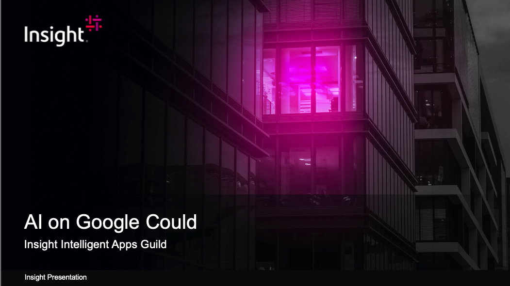

# GoogleCloudAI

This repos is a training presentation for the Intelligent Application Guilds at Insight Digital Innovation.

## Contents

Please join the intelligent apps guild for "Google Cloud AI Platform".  This presentation will be an beginner level presentation on the services that make up the Google Cloud AI platform.  We will cover Google's AI philosophy, TPUs and Google's AI infrastructure, An overview of GCP's Cloud AI building blocks with code samples for video and vision, An overview and AutoML and building a custom model for vision, and a brief overview of the larger AI platform for custom models on google cloud.

## Code Samples

The code samples in the project use jupyter notebooks with python and bash.

Install Python - https://www.python.org/downloads/

Jupyter Setup - https://jupyter.org/install

If Running on windows, you may need to use a linux VM or subsytem for linux for the bash examples

## Samples

Vision/Vision.ipynb - Inference with Could AI Vision through python and bash

Video/Video.ipynb - Inference with Cloud AI Video through python and bash

AutoML-Vision/AutoMLVision.ipynb - Inferance on a custom model created and deployed with Auto ML

